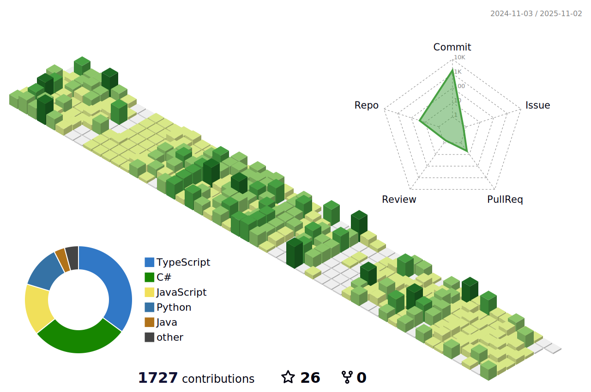
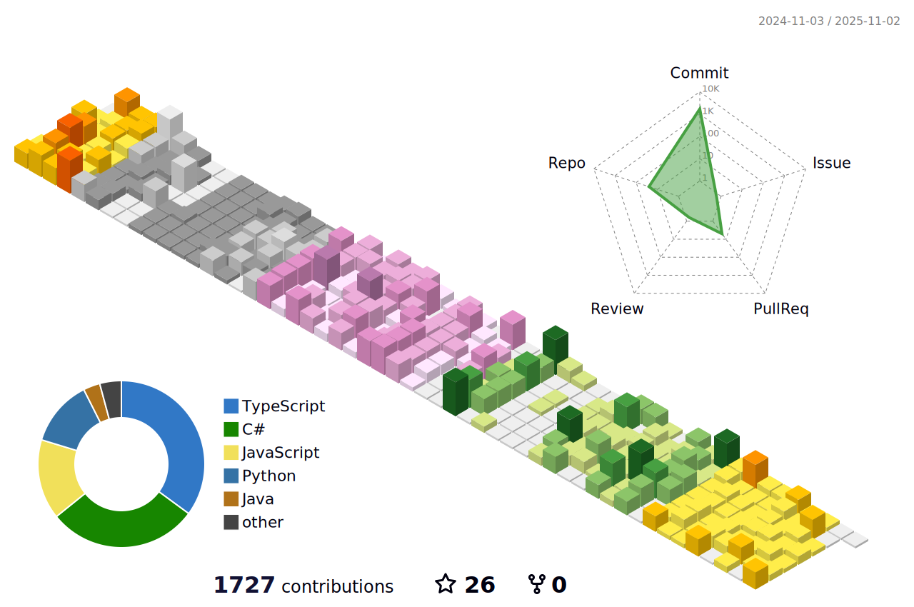
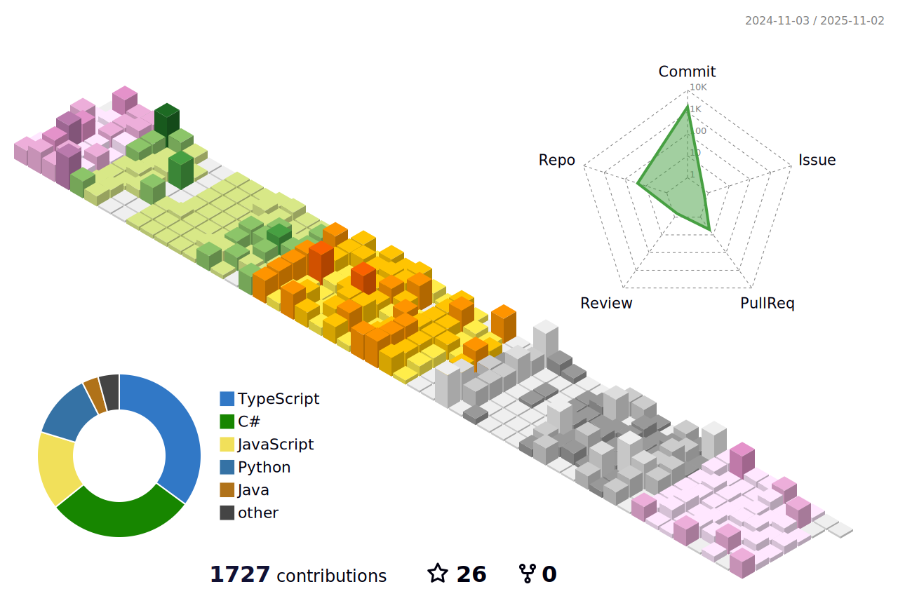
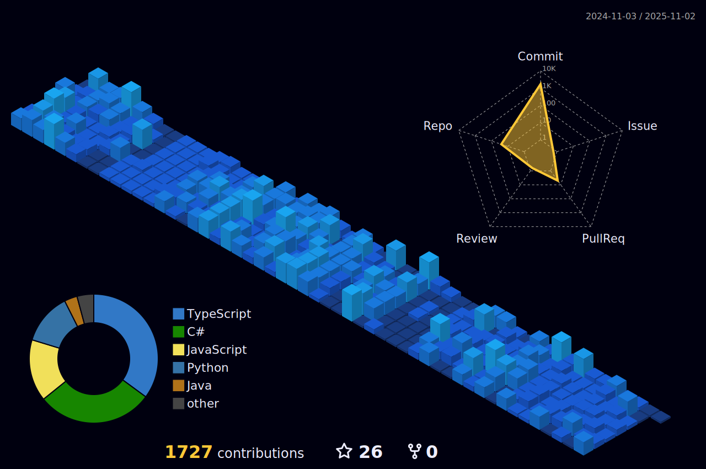
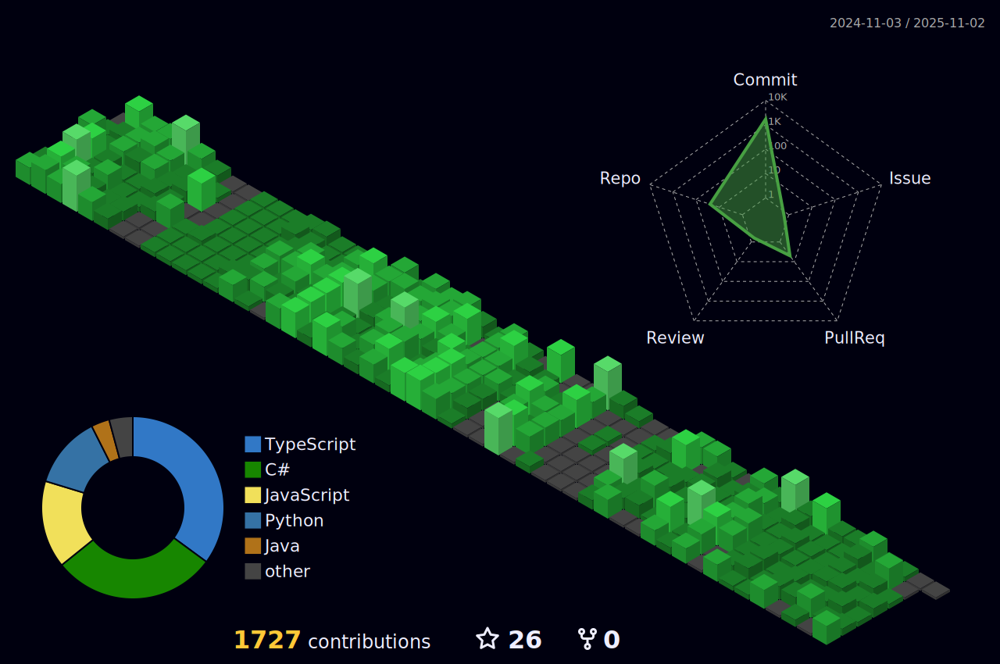
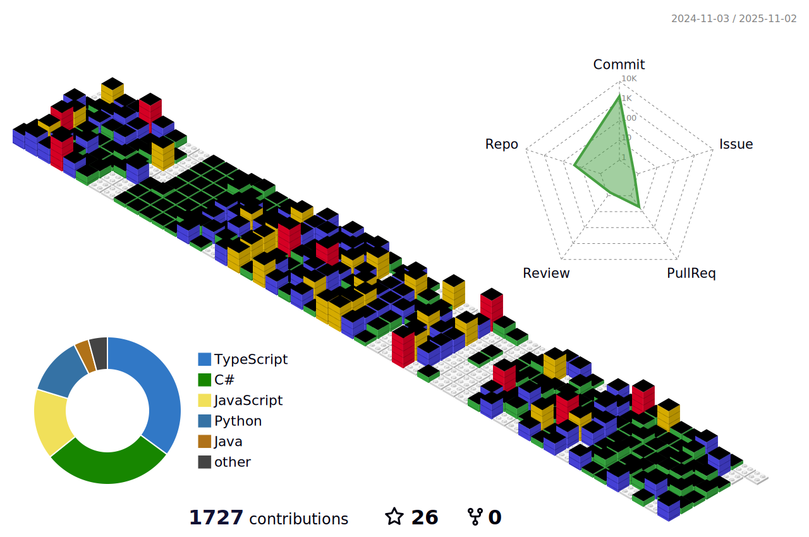

## 🙋 Repo Index

Welcome to my repository index! This page serves as a central hub for most of my GitHub projects, organized by category.

🧠 Self-Learning

**C# & .NET**
- [Entity Framework Core in .NET](https://github.com/IanD1013/dometrain-efcore-dotnet)
- [C#](https://github.com/IanD1013/csharp-learning)
  - [Getting Started & Deep Dive: C#](https://dometrain.com/course/deep-dive-csharp/)
  - [LINQ in .NET](https://dometrain.com/course/from-zero-to-hero-linq-in-dotnet/)
  - Design Patterns in C#
  - [Asynchronous Programming in C#](https://dometrain.com/course/from-zero-to-hero-asynchronous-programming-in-csharp/)
  - [Dependency Injection in .NET with C#](https://dometrain.com/course/from-zero-to-hero-dependency-injection-in-net/)

**JavaScript & Frontend**
- [Node](https://github.com/IanD1013/vidly-api)
- [JavaScript Unit Testing](https://github.com/IanD1013/javascript-testing-course)
- [React 18 Intermediate Topics](https://github.com/IanD1013/react-intermediate-topics)
- [React Testing](https://github.com/IanD1013/react-testing)
- [Redux](https://github.com/IanD1013/redux-learning)

**Java & Spring**
- [Java](https://github.com/IanD1013/datastructure-algorithms-designpatterns-java)
  - [Fundamentals](https://codewithmosh.com/p/the-ultimate-java-mastery-series)
  - [Data Structures and Algorithms](https://codewithmosh.com/p/data-structures-algorithms)
  - [Design Patterns in Java](https://codewithmosh.com/p/design-patterns)
- [Spring Boot](https://github.com/IanD1013/store-springboot)

**Python & Django**
- [Python](https://github.com/IanD1013/python_projects)
- [Django](https://github.com/IanD1013/storefront-django)

💻 Frontend Projects

- [Filmpire](https://github.com/IanD1013/filmpire)
- [Gamehub](https://github.com/IanD1013/game-hub)
- [Xora](https://github.com/IanD1013/xora)
- [Meshify](https://github.com/IanD1013/meshify)
- [Currency Graph](https://github.com/IanD1013/currency-exchange-rates-graph)

💻 Full Stack Projects

- [Dev Overflow](https://github.com/IanD1013/dev-overflow)
- [Chirper](https://github.com/IanD1013/chirper)
- [Issue Tracker](https://github.com/IanD1013/issue-tracker)

<!-- GitHub Activity Graph -->
<table>
  <tr>
    <td>
      <picture>
        <source media="(prefers-color-scheme: dark)" srcset="https://github-readme-activity-graph.vercel.app/graph?username=IanD1013&theme=tokyo-night" />
        <source media="(prefers-color-scheme: light)" srcset="https://github-readme-activity-graph.vercel.app/graph?username=IanD1013&theme=xcode" />
        
      </picture>
    </td>
  </tr>
</table>

<!-- GitHub 3D Contribution Graph -->

📊 3D Contribution Graph

<h3>🌈 Rainbow Theme</h3>

<h3>🌲 Green Theme</h3>

<h3>🌺 Season Theme</h3>

<h3>🌏 South Season Theme</h3>

<h3>🌃 Night Theme</h3>

<h3>🎮 Git Block Theme</h3>

